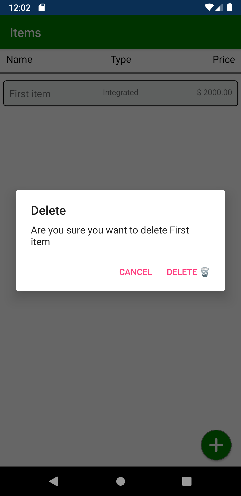
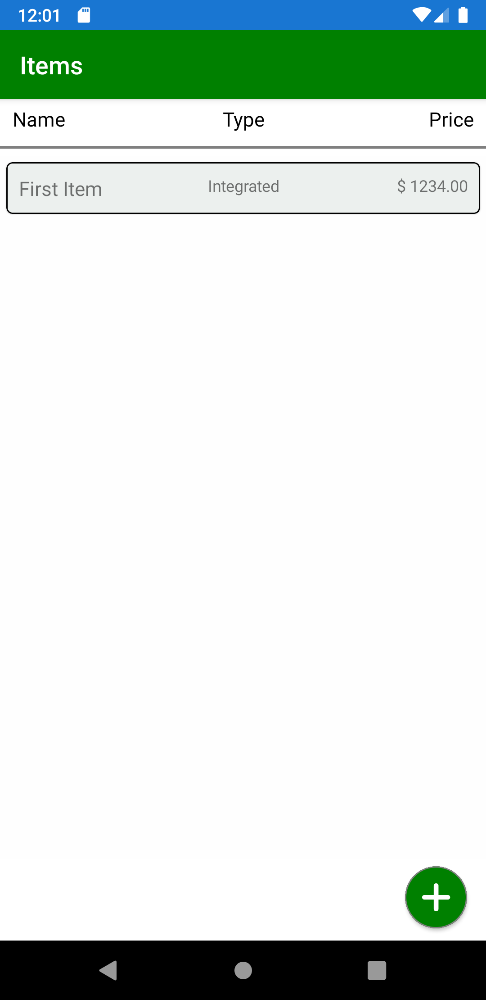
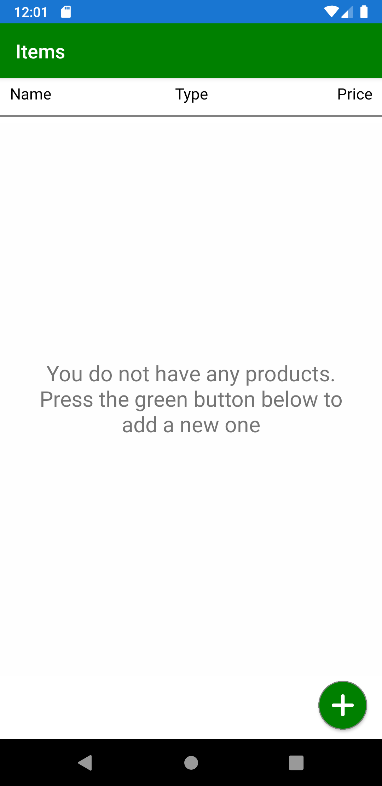
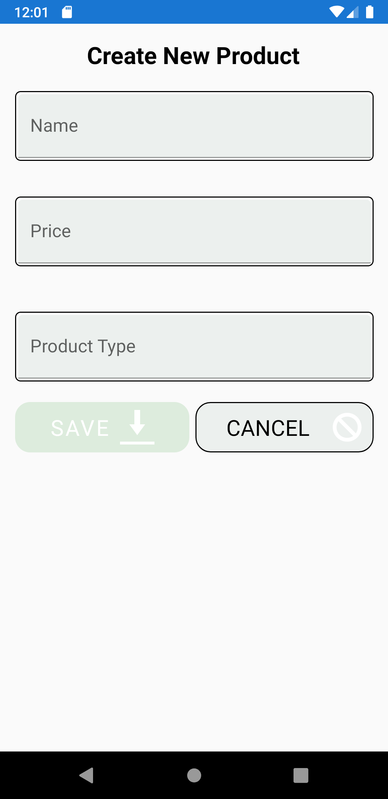
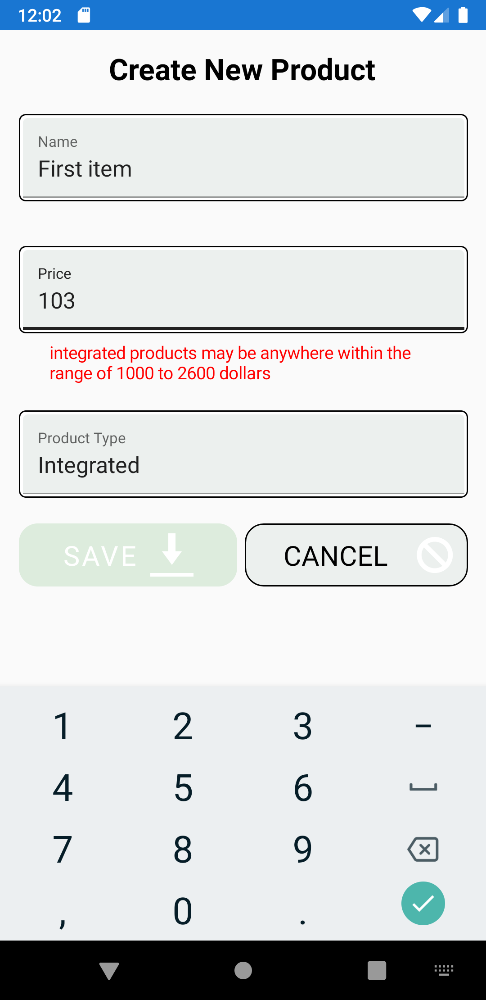
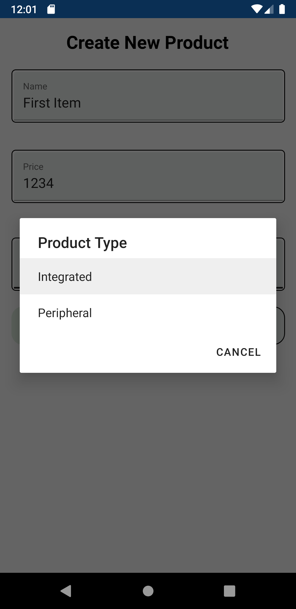
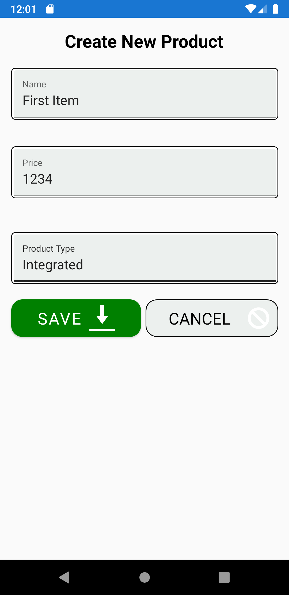
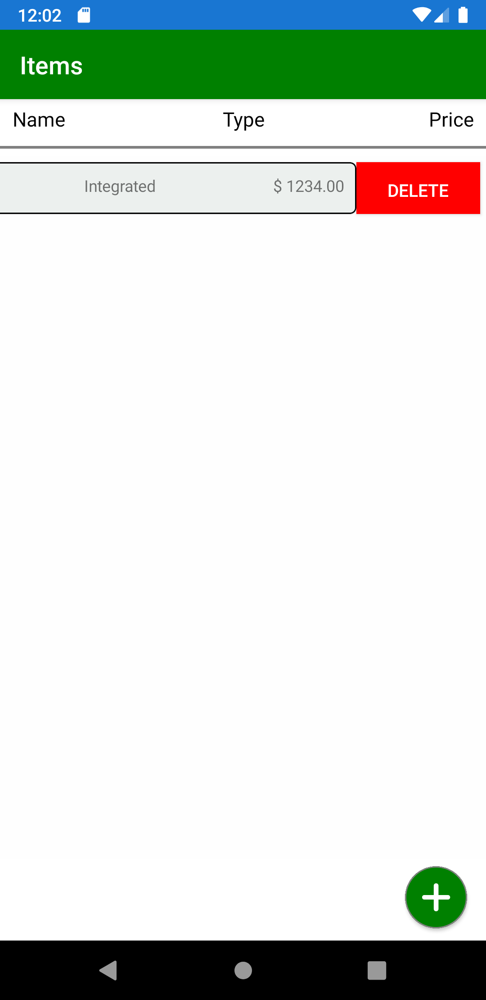

<!-- language-all: javascript -->
# Employment-Technical-Task

Your task is to create a new [Expo](https://docs.expo.dev/) app using the [TypeScript template](https://docs.expo.dev/guides/typescript/#starting-from-scratch-using-a-typescript-template) that has a **product storage** where the user can add/edit and delete (CRUD) products.

[](https://docs.expo.dev/)  [](https://www.typescriptlang.org/) [](https://jestjs.io/docs/tutorial-react-native)

[](https://www.crossplatform.se/) [](https://github.com/prettier/prettier)

## General Requirements
- The app runs on iPhone (X) and Android (Pixel).
- The app should have an [easy to read](https://betterprogramming.pub/writing-readable-and-maintainable-code-in-typescript-237accdd8b05) architecture [organized by feature](https://codeopinion.com/organizing-code-by-feature-using-vertical-slices/)
- The App should be build with React Native Expo [TypeScript template](https://docs.expo.dev/guides/typescript/#starting-from-scratch-using-a-typescript-template).
- TypeScript build `tsc` passes without errors.
- [avoid using `any` or untyped objects](https://43081j.com/2019/02/typescript-avoid-using-any).
- The product storage uses React Hooks/Context.
- The products are saved in [storage](https://docs.expo.dev/versions/latest/sdk/async-storage/) and restored into context upon cold start. 
- Git history should be clean and readable.
- Create a new branch for each task you develop and use Pull Request to merge it into the main branch. 
- The app uses react navigation for [moving between screens](https://reactnavigation.org/docs/navigating). *Tabs* or *Drawer* navigation is **not** required by this app.
* The user can delete an existing product using either an additional button on Edit screen or a [swipable action](#bonus-points) in the list



## Tasks

The project is a system that represent a store with products. Using the system the user can add new products and edit and delete existing products.

**Remarks:** the screenshots is only an example design and your final app **does not** have to look exactly like the screenshots. You can use any UI framework you find appropriate.

### List products screen
The app displays an initially empty list of products (below).

* Using a FAB button (for example [this one](https://callstack.github.io/react-native-paper/fab.html)) the user can navigate to add/edit product screen (below).

<center><p>




</p>
</center>


### Edit product screen
The add/edit product screen has a form for product details.

* The screen takes a parameter that determines if it's a new product or existing one (chosen from the list).
* Upon successfull save the product is added / updated in the products store (context).
* Cancel button navigates back.

#### Validation
The form is validated and displays error messages for invalid data (e.g [formik](https://formik.org/docs/guides/react-native), [react-hook-forms](https://react-hook-form.com/)).

* The user cannot save if the data is invalid (above).
* The user cannot add a product if there is another product with the same name.

#### Product type
The user can pick product type using a cross-platform picker / bottom sheet.

There are two types of products:

1.  Peripheral
2.  Integrated

**Peripheral** products can have any price larger than $0 (zero).

**Integrated** products can have any price between $1000 and $2600

<center><p>







</center>

## Bonus points
Gryffindor recieves bonus points for each of the below tasks. None are required but a nice feather in your hat.

- High *Separation of Concern*; i.e files split into components, actions, hooks etc.
- [`package.json`](./package.json) has valid scripts for all and any commands you use. 
- The project uses [prettier](https://github.com/prettier/prettier) and [eslint](https://eslint.org/) for the `lint` command and linting pass without errors. E.G:

```json
{
  "main": "node_modules/expo/AppEntry.js",
  "scripts": {
 		"lint": "prettier -c --write . && eslint . --ext .js,.jsx,.ts,.tsx --fix",
  }
}
```

You can check out the valid example config in the **[config-expo](./config-expo)** folder.

- React Navigation is [typed using TypeScript](https://reactnavigation.org/docs/typescript)
- The app uses [swipable list](https://github.com/esthor/react-native-swipeable-list) to delete products.



- Validation has [typed rules](https://formik.org/docs/guides/typescript).
- Add back handler to edit form and warn if user goes back without saving.

## What is next

After you are done with your code please push your code to master by making a **Pull Request** from another branch and tell us so we merge it .

We will be asking you about your code and choices, so make sure you can motivate them.

You do not need to copy the UI design but it is better to keep it as close as possible to it. However, if you made a noticeable change you will be asked about the reason behind it.

Good luck!
